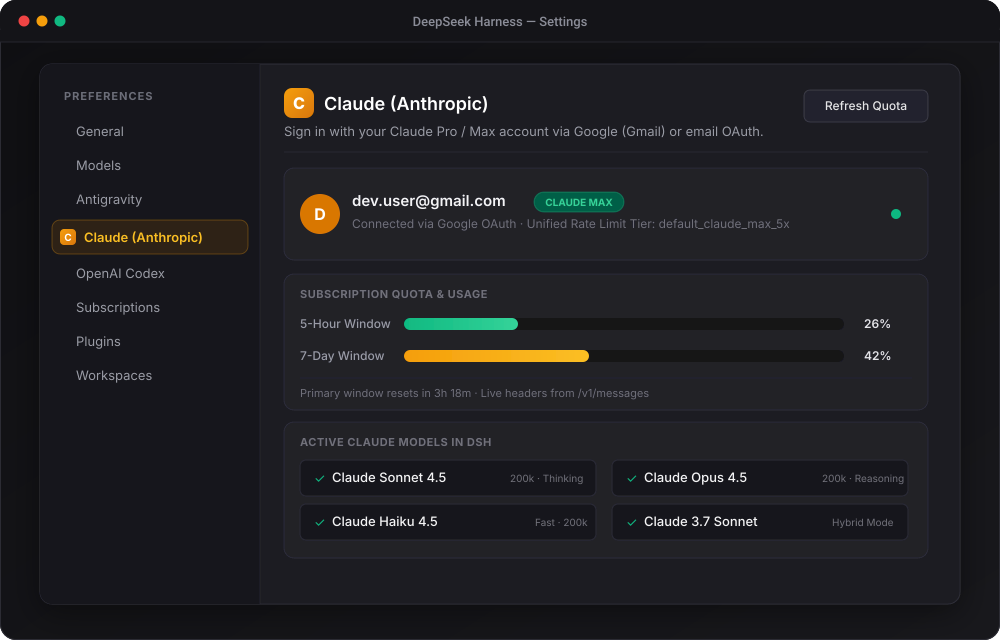
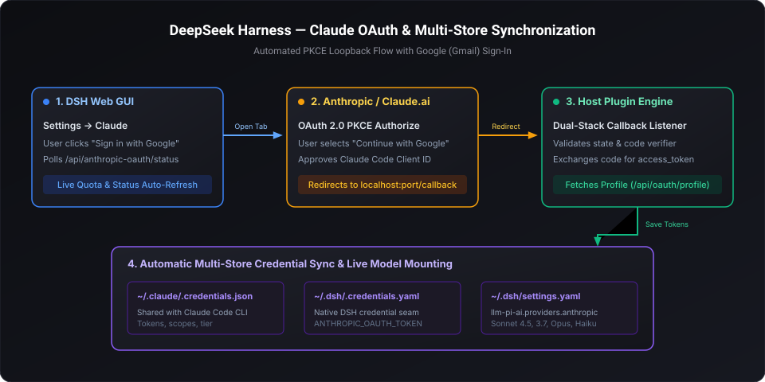

# dsh-claude-oauth

[](https://github.com/grloper/dsh-claude-oauth)
[](https://opensource.org/licenses/MIT)
[](https://github.com/deepseek-ai/deepseek-harness)
[](https://github.com/grloper)

**Claude Pro / Max OAuth integration for DeepSeek Harness (DSH)** — sign in directly with your Google / Gmail account from the DSH Web Settings page, with automatic token rotation, live model discovery, and real-time 5-hour / 7-day subscription quota tracking.

[English](README.md) · [简体中文](README.zh.md) · [Technical Article](ARTICLE.md)

---

## Preview



---

## Key Features

* 🚀 **One-Click Google / Gmail Sign-In in Settings**: Dedicated **Claude** section in DSH Settings (`order: 13`, beside Antigravity and Codex). Click **"Sign in with Google / Gmail"** to authenticate directly in your browser.
* ⚡ **Zero Terminal Hassle**: No manual CLI token dumping, copying strings, or editing YAML config files.
* 🔄 **Dual-Stack PKCE OAuth Engine**: Ephemeral loopback callback server listening on dual-stack IPv4 (`127.0.0.1`) and IPv6 (`::1`), avoiding Windows localhost resolution traps.
* 🛡️ **Multi-Store Credential Sync**: Exchanged tokens automatically sync to:
  * `~/.claude/.credentials.json` (shares authorization with the official Claude Code CLI)
  * `~/.dsh/.credentials.yaml` (`ANTHROPIC_OAUTH_TOKEN` and `CLAUDE_CODE_OAUTH_TOKEN`)
  * `~/.dsh/settings.yaml` (configures `llm-pi-ai.providers.anthropic` with active models)
* 📊 **Live Subscription Quota Meters**: Displays real-time **5-hour** and **7-day** quota utilization bars with reset countdowns in both Settings and the ambient chat composer dock.
* 🤖 **Live Model Catalog**: Queries `GET /v1/models` dynamically. All latest Claude releases (Claude 3.7 Sonnet, Claude Sonnet 4.5, Claude Opus 4.5, Claude Haiku 4.5) mount automatically.

---

## Architecture Flow



---

## Quick Start

### Installation

Install `dsh-claude-oauth` into your active DSH Web profile:

```bash
# From GitHub repository
dsh plugin --profile web add github:grloper/dsh-claude-oauth

# Or from local checkout
dsh plugin --profile web add ./dsh-claude-oauth
```

### Sign In via Web Settings

1. Start or open DeepSeek Harness Web GUI:
   ```bash
   dsh web
   ```
2. Open **Settings** (gear icon on the sidebar).
3. Select the **Claude** section from the navigation list.
4. Click **"Sign in with Google / Gmail"**.
5. In the opened browser window, choose **"Continue with Google"**, pick your Gmail account, and click **Authorize**.
6. The tab will display **"Claude Connected"**. Return to DSH — your account email, tier (`CLAUDE PRO` or `CLAUDE MAX`), live quota bars, and models are now active!

### Optional: Sign In via CLI

You can also authenticate directly from the command line using the bundled bin script:

```bash
claude-oauth-login
# Or via npx
npx dsh-claude-oauth
```

---

## Setting Claude as Default Agent Model

To make Claude Sonnet 4.5 your default model for all sessions:

In `~/.dsh/settings.yaml`:
```yaml
agent-default-model:
  provider: anthropic
  model: claude-sonnet-4-5
```

Or pick Claude per-session from the composer model selector.

---

## Verification & Testing

Run the included test suite:

```bash
npm run check
npm test
```

---

## License

[MIT](LICENSE) © 2026 [grloper](https://github.com/grloper)
